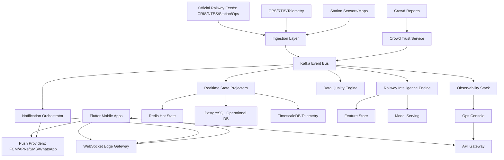
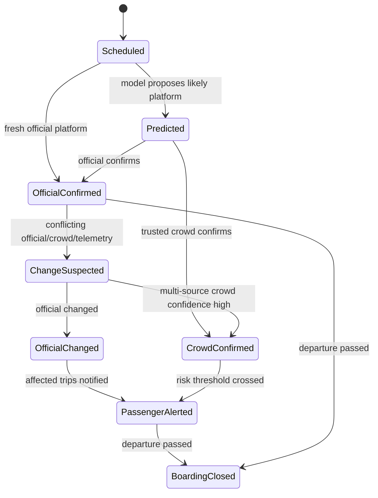
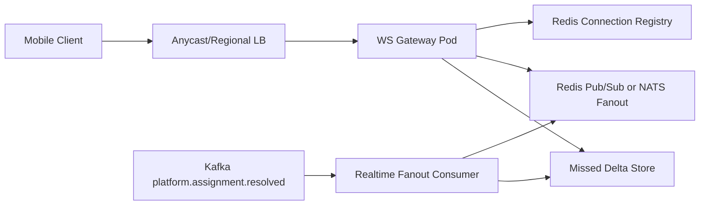
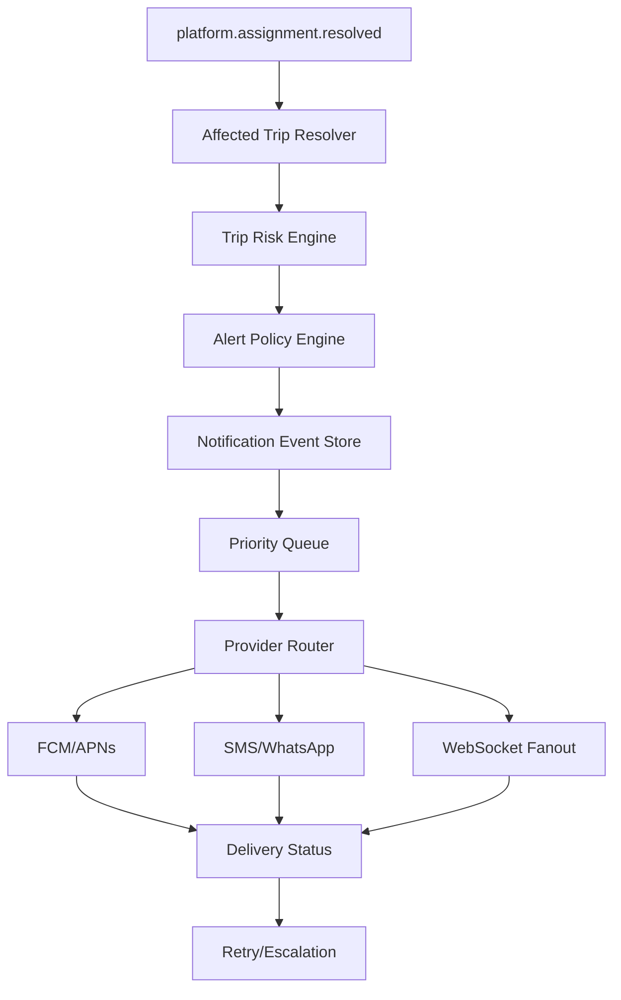

# India Railway Intelligence Platform: Production Architecture

Mission: eliminate railway platform confusion and missed trains caused by last-minute platform changes.

This is not a booking app. It is a realtime passenger operations platform that fuses official railway data, telemetry, crowd evidence, station maps, predictive models, and high-reliability notifications into one passenger-facing decision system.

## 1. Operating Principles

The product should behave like transport infrastructure, not like a consumer feed.

Core principles:

- Official data is authoritative when fresh and internally consistent, but the system must detect lag, contradiction, and stale state.
- Every user-facing platform claim must carry provenance, confidence, freshness, and a last-updated timestamp.
- Prediction is allowed before official confirmation, but the UI must distinguish "official", "high-confidence prediction", and "crowd-confirmed".
- Alerts must be conservative. A wrong "stay where you are" message is worse than a cautious "platform likely changed, start moving and verify".
- Realtime correctness is a product feature. The system needs explicit SLOs, incident response, source health scoring, and audit logs.
- Crowdsourcing is not a replacement for railway integration. It is a verification and anomaly-detection layer.
- Station rollout should be operationally deep before it is geographically broad.

Target production SLOs:

| Capability | Target |
|---|---:|
| Critical platform-change alert pipeline p95 after trusted event ingest | under 3 seconds |
| WebSocket fanout p95 in same region | under 1 second |
| Push notification enqueue p95 | under 2 seconds |
| Official feed freshness detection | under 10 seconds after source SLA breach |
| Platform assignment auditability | 100 percent event sourced |
| Notification idempotency | 100 percent deduped per trip and state version |
| Station map offline availability for active trip | 99 percent before station arrival |
| Critical-path service uptime | 99.95 percent initially, 99.99 percent at national scale |

## 2. Official Context And Constraints

The durable data strategy must start with formal railway partnerships.

Relevant official baseline:

- CRIS describes NTES as the system for near-real-time passenger train running information for Indian Railways and lists passenger-facing capabilities such as spot-your-train, ETA/ETD, expected trains at station, cancellations, and diversions. Source: https://cris.org.in/loadpage?page=proNTES
- Press Information Bureau states that NTES was developed by CRIS, the IT wing of Indian Railways, and collects train running information on a near real-time basis for dissemination through multiple interfaces. Source: https://www.pib.gov.in/newsite/PrintRelease.aspx?relid=99159
- CRIS states it is under the Ministry of Railways and references national-scale workloads such as ticketing for around 2 crore passengers daily and more than 3.5 crore train movement and arrival/departure enquiries daily. Source: https://cris.org.in/
- India Code publishes the Digital Personal Data Protection Act, 2023. The platform must treat PNR, phone, location, device identifiers, family groups, and emergency mode as personal data. Source: https://www.indiacode.nic.in/bitstream/123456789/22037/1/a2023-22.pdf

Strategic implication: the company should not build its core operating model around scraping public interfaces. Scraping can be a temporary research input for non-production validation only, behind legal review. Production must rely on contracts, APIs, secure railway data exchange, station-level integrations, and explicit passenger consent.

## 3. Product Surface

The user does not want dashboards. The user wants certainty under stress.

Primary passenger workflows:

- Add journey by PNR, train number, ticket screenshot, calendar import, or manual train plus station selection.
- Confirm boarding station, intended arrival time, passenger mobility needs, family companions, and emergency mode preference.
- Receive proactive station-arrival, platform, coach-position, boarding-window, and platform-change alerts.
- See one high-signal trip card: train, station, platform status, confidence, coach position, walking time, latest evidence, and next action.
- Navigate from station entrance to platform, then to coach zone.
- Share trip status with family without exposing full PNR or unnecessary location history.
- Use offline mode when the station network is poor.

Operational UX states:

- Official confirmed: green/steady visual language, source and timestamp shown.
- High-confidence prediction: amber, explicit "likely" language, action-oriented but not absolute.
- Conflict detected: red/urgent, "verify at display board or staff" plus fastest path options.
- Stale data: grey/amber, timestamp prominent, do not hide uncertainty.
- Emergency travel mode: louder alerts, repeated reminders, family escalation, simplified instructions.

## 4. High-Level Architecture



Production stack:

- Mobile: Flutter, local SQLite/Drift, encrypted storage, background geofencing, FCM/APNs, watch integrations.
- Backend: Node.js plus TypeScript for APIs, realtime gateways, orchestration, ingestion adapters, notification systems.
- ML: Python for training and feature engineering; online model serving via gRPC/HTTP. Keep hard realtime state transitions outside ML.
- Event bus: Kafka for national-scale immutable streams and replay; RabbitMQ can be used for command/task queues, but Kafka should be the backbone.
- Cache: Redis Cluster for hot trip state, connection registry, dedupe, rate limits, and realtime fanout metadata.
- Databases: PostgreSQL for operational data, TimescaleDB for telemetry and station time series, object storage for raw evidence/media, lakehouse for training data.
- Cloud: AWS or Google Cloud with Kubernetes, multi-zone clusters, CDN, private networking, WAF, KMS, managed Kafka where possible.
- Observability: OpenTelemetry, Prometheus, Grafana, Loki/ELK, Jaeger/Tempo, PagerDuty/Opsgenie.

## 5. Event-Driven Realtime Architecture

Everything important becomes an event. The system must be replayable because railway truth changes over time.

Core Kafka topics:

| Topic | Key | Purpose |
|---|---|---|
| `official.train.running.raw` | train_run_id | Raw official train movement and ETA/ETD updates |
| `official.station.platform.raw` | station_id | Station platform announcements, display-board events, operator inputs |
| `train.telemetry.raw` | train_run_id | GPS/RTIS/telemetry samples |
| `crowd.report.raw` | station_id | Passenger confirmations and contradictions |
| `crowd.report.scored` | train_run_stop_id | Trust-weighted crowd evidence |
| `platform.assignment.candidate` | train_run_stop_id | Any proposed platform state |
| `platform.assignment.resolved` | train_run_stop_id | Reconciled platform truth with confidence |
| `delay.prediction.updated` | train_run_id | Delay estimates and cascade predictions |
| `congestion.prediction.updated` | station_id | Platform and route congestion |
| `trip.risk.updated` | trip_id | User-specific risk state |
| `notification.command` | user_id | Commands to notify a passenger |
| `notification.delivery.status` | notification_id | Provider delivery and acknowledgment |
| `data.quality.incident` | station_id/train_id | Source conflicts, stale feeds, impossible states |

Event contract requirements:

- globally unique event ID
- source ID
- event-time and ingest-time
- idempotency key
- schema version
- payload hash
- provenance block
- confidence block
- causality references to prior events

Example platform event:

```json
{
  "event_id": "evt_01h...",
  "schema_version": 3,
  "event_type": "platform_assignment_candidate",
  "train_run_stop_id": "trs_...",
  "station_code": "NDLS",
  "train_number": "12952",
  "candidate_platform": "8",
  "assignment_kind": "changed",
  "source": {
    "source_id": "src_station_display_ndls",
    "kind": "official_station",
    "observed_at": "2026-05-20T10:14:33+05:30",
    "ingested_at": "2026-05-20T10:14:34+05:30"
  },
  "confidence": {
    "source_confidence": 0.97,
    "freshness_score": 0.99,
    "reconciliation_score": 0.92
  },
  "idempotency_key": "NDLS:12952:2026-05-20:platform:8:v42"
}
```

## 6. Realtime Platform Update Pipeline

The platform pipeline is the heart of the product.

Pipeline stages:

1. Source ingest receives official station update, NTES-style train movement update, railway partner event, GPS/telemetry signal, crowd report, or operator override.
2. Ingest validates schema, source credentials, clock skew, dedupe key, station/train identity, and event plausibility.
3. Raw event is persisted in immutable storage and published to Kafka.
4. Normalizer maps external railway entities to internal `train_run`, `station`, `platform`, and `train_run_stop`.
5. Candidate generator emits `platform.assignment.candidate`.
6. Reconciliation engine compares official, station, telemetry, crowd, historical, and model signals.
7. State projector writes the new resolved state to PostgreSQL and Redis with a monotonic `platform_state_version`.
8. Trip risk engine finds affected passenger trips and computes urgency based on user location, walking time, train ETA, crowd density, mobility profile, and current platform.
9. Notification orchestrator sends WebSocket, push, watch, SMS/WhatsApp fallback, and family alerts according to severity.
10. Client receives state delta, stores it offline, updates UI, and requests navigation if the passenger is in or near the station.

Platform state machine:



Important decision: every passenger alert references a state version. If a newer version arrives before delivery, old alerts are suppressed or amended.

## 7. Infrastructure For Millions Of Concurrent Users

Assume national peaks during festivals, weather disruption, and major station incidents.

Traffic shape:

- Read-heavy trip status checks.
- Spiky station-level subscriptions near departure windows.
- High fanout for one platform change at a major station.
- Mobile network instability and retry storms.
- Notification provider throttling.

Scale strategy:

- Partition event streams by `train_run_id`, `station_id`, or `train_run_stop_id` depending on workload.
- Keep hot passenger trip state in Redis, backed by PostgreSQL.
- Precompute affected trip cohorts per train run stop.
- Use fanout by reference for high-cardinality alerts: store one canonical alert state, deliver personalized shells.
- WebSocket gateway is stateless except for connection/session registry stored in Redis.
- Use backpressure-aware consumers and dead-letter topics for malformed or delayed events.
- Run regional Kubernetes clusters close to users, with active-active read and active-passive write per shard initially.
- Use CDN and edge caching for static station maps, route tiles, coach layout metadata, and offline packs.

Capacity design example:

- 20 million MAU
- 2 million daily active trips
- 500,000 concurrent WebSocket connections at normal peak
- 3 million concurrent connections during disruption peak
- 100,000 notifications per minute normal peak
- 2 million notifications per minute disruption burst with prioritization and provider fallback

The system should degrade by priority:

1. Critical platform changes
2. Departure and boarding deadlines
3. Official delay changes
4. Station navigation updates
5. Coach-position hints
6. Non-critical engagement features

## 8. Scalable WebSocket System

Use WebSockets for realtime in-app state, not as the only critical alert path. Critical alerts must also go through push.

Gateway responsibilities:

- Authenticate user/device session with short-lived JWT.
- Subscribe to trip, train, station, and family topics.
- Send initial snapshot after connect.
- Send ordered deltas with sequence numbers.
- Require client acknowledgments for critical deltas.
- Track heartbeat and network quality.
- Apply server-side rate limits and topic ACLs.

Topology:



Connection model:

- `user:{user_id}` for direct alerts.
- `trip:{trip_id}` for trip state.
- `train_run:{train_run_id}` for live tracking.
- `station:{station_id}:departures` for station board updates.
- `family:{family_group_id}` for shared travel status.

Ordering:

- Each trip stream has a monotonic sequence.
- Client persists `last_seen_sequence`.
- On reconnect, client requests missed deltas.
- If delta gap is too large, server sends full snapshot.

Backpressure:

- Critical messages bypass low-priority queue.
- Per-connection outbound buffer is capped.
- Slow clients receive compacted state, not every intermediate event.
- Major station fanout uses topic-level aggregation so one event does not trigger millions of DB reads.

## 9. Railway Intelligence Engine

The intelligence engine is a collection of deterministic and probabilistic systems.

Components:

- Source health scorer: freshness, lag, contradiction frequency, historical accuracy.
- Entity resolver: maps train numbers, service dates, station codes, platform labels, and run variants.
- Reconciliation engine: produces current operational truth with confidence.
- Platform prediction model: predicts likely platform before official announcement.
- Delay cascade model: predicts downstream delay propagation.
- Congestion model: predicts station and route congestion.
- Anomaly detector: detects impossible states such as departed train still far away, sudden platform reversal, stale official feed, or crowd contradiction surge.
- Passenger risk engine: computes whether a user is likely to miss boarding without intervention.
- Explanation engine: produces short evidence summaries for UI and operator console.

Key design rule: the ML layer proposes; deterministic safety logic disposes. A model should not directly push a critical platform alert without policy checks, confidence thresholds, and source reconciliation.

## 10. AI Prediction Pipeline

Training data:

- historical train run stops
- platform assignment history
- actual arrival/departure times
- planned schedules
- station layout and line/platform constraints
- train type, route, rake length, operational patterns
- previous and next train conflicts
- weather and disruption metadata where licensed
- crowd density and station dwell patterns
- source lag and correction history

Feature groups:

- train identity: train number, service type, route family, rake type
- station context: terminal/pass-through, platform topology, dominant lines, turnaround behavior
- time context: day of week, holiday, festival season, hour, monsoon period
- operational state: current delay, upstream delay, approaching line, last crossed station
- congestion context: platform occupancy, expected passenger flow, local disruption
- source context: official feed freshness, recent contradictions, platform change history

Models:

- Platform prediction: gradient boosted trees or tabular deep model for top-k platform probabilities; graph constraints applied after prediction.
- Delay prediction: temporal graph model or sequence model over route, with calibrated ETA output.
- Delay cascade: graph propagation model over train interactions and station bottlenecks.
- Congestion prediction: time-series model with station graph features.
- Anomaly detection: hybrid rules plus isolation forest/autoencoder over event sequences.
- Confidence calibration: isotonic regression or Platt scaling per station/train family.

Online serving:

- Feature materialization in low-latency feature store.
- Model service returns top-k predictions, confidence, explanation features, and calibration bucket.
- Predictions are published as events, not written directly to passenger state.
- Shadow models can run without user impact until calibrated.

Model governance:

- Every prediction stores model version, features snapshot hash, output, explanation, and eventual outcome.
- Measure calibration by station and train family, not only global AUC.
- Block or downgrade models during source-health incidents.
- Human operations can disable a model per station.

## 11. Crowd Verification Trust System

Crowd reports are valuable because platform changes are locally visible before global systems update. They are risky because crowds can be wrong, malicious, duplicated, or confused by station layout.

Evidence types:

- platform display board seen
- station announcement heard
- train physically arrived at platform
- coach position board seen
- contradictory platform information
- photo/video evidence where legally allowed and privacy-safe

Trust score factors:

- historical accuracy of reporter
- proximity to station/platform geofence
- dwell time inside station
- device sensor consistency
- agreement with independent users
- agreement with official update after delay
- report timeliness
- station-specific familiarity
- account age and abuse history
- media evidence quality without storing unnecessary personal data

Anti-abuse:

- Do not let one user trigger a critical alert.
- Cluster reports by physical independence: different devices, different accounts, different movement histories.
- Downweight users moving too fast, outside geofence, or repeatedly contradicting final truth.
- Detect coordinated bursts from new accounts.
- Use per-station trust, not just global trust.
- Hold crowd-only alerts to cautious wording unless confidence is high and user risk is high.

Crowd confidence formula:

```text
crowd_score =
  sigmoid(
    sum(report_trust_weight * evidence_strength * recency_decay)
    + independence_bonus
    + media_bonus
    + geofence_bonus
    - contradiction_penalty
    - abuse_risk_penalty
  )
```

Crowd states:

- `unverified_signal`: visible only to internal systems
- `crowd_suspected`: user-facing only as caution when risk is high
- `crowd_confirmed`: enough independent high-trust evidence
- `officially_confirmed`: official source agrees
- `crowd_rejected`: later contradicted by stronger evidence

## 12. Confidence Scoring Model

Confidence is not one number internally. It is a composed judgment.

Inputs:

- source authority
- source freshness
- source historical accuracy
- cross-source agreement
- model probability
- station operational feasibility
- crowd trust
- telemetry consistency
- time to departure
- cost of false positive versus false negative

Proposed resolved platform score:

```text
resolved_confidence =
  w1 * official_authority_score
  + w2 * freshness_score
  + w3 * cross_source_agreement
  + w4 * crowd_trust_score
  + w5 * model_calibrated_probability
  + w6 * topology_feasibility_score
  + w7 * telemetry_consistency_score
  - w8 * contradiction_score
  - w9 * source_staleness_penalty
```

Confidence bands:

| Band | Range | Passenger language |
|---|---:|---|
| Very low | 0.00-0.39 | "Platform not reliable yet" |
| Low | 0.40-0.59 | "Possible change, verify locally" |
| Medium | 0.60-0.74 | "Likely platform" |
| High | 0.75-0.89 | "High-confidence platform" |
| Critical | 0.90-1.00 | "Official/corroborated platform" |

Alert policy should consider risk, not just confidence. A medium-confidence change can still deserve an urgent warning if the passenger is far from the new platform and departure is imminent.

## 13. Geofencing Architecture

Geofencing must work with poor connectivity and respect battery/privacy.

Layers:

- Coarse station geofence: OS-level polygon or circular fence around station.
- Inner station geofence: entry gates, concourse, foot overbridge, platform corridors.
- Platform zone geofence: platform-specific polygons where GPS is usable.
- Indoor hints: BLE beacons, Wi-Fi RTT, QR checkpoints, visual markers, or station infrastructure where partnership allows.
- Server-side risk geofence: coarse location plus ETA to station when user grants live location.

Client strategy:

- Download station geofence pack before arrival.
- Use OS geofence triggers for background wakeups.
- Switch to foreground high-accuracy navigation only near station and only when needed.
- Store location events locally when offline and sync minimal derived facts later.
- Avoid continuous server location streaming unless emergency/family mode is enabled by consent.

Server strategy:

- Convert geofence events into trip-risk events.
- Use location only for immediate travel assistance and fraud-resistant crowd trust.
- Retain raw location for the shortest legally and operationally acceptable period.
- Keep derived state such as "inside station" or "near platform 7" separately from raw coordinate history.

## 14. Offline Synchronization Strategy

Stations often have weak network coverage. Offline mode is core infrastructure.

Pre-trip cache:

- trip details
- train schedule
- last known platform state and confidence
- station map pack
- platform graph and walking routes
- coach position rules when known
- critical phrase translations
- emergency contacts and family sharing preferences

Sync design:

- Local database: SQLite with Drift.
- Conflict model: server state has version numbers; client stores deltas and pending actions.
- Critical server deltas are idempotent and monotonic.
- Crowd reports can be queued offline but are marked late and discounted by recency.
- Platform state is never overwritten by stale offline data.

Offline UI:

- Prominently show "last updated at".
- Continue navigation with cached station graph.
- Allow manual verification checklist: display board, announcement, staff, platform sign.
- Reconnect silently and reconcile state.

## 15. Station Navigation System

This is not generic maps. It is station-specific passenger movement intelligence.

Data model:

- nodes: entrances, ticket gates, concourse points, foot overbridge junctions, lifts, stairs, escalators, platform access points, coach zones
- edges: walking path, stairs, escalator, lift, ramp, restricted corridor
- weights: distance, expected walking time, accessibility, congestion, luggage penalty, family penalty
- landmarks: display boards, helpdesk, toilets, water, waiting rooms, exit gates
- constraints: one-way movement, construction closures, platform access restrictions

Routing:

- A* or contraction hierarchy over station graph.
- Dynamic edge weights from congestion predictions.
- Accessibility mode avoids stairs and long transfers.
- Emergency mode chooses fastest safe route and escalates to family.
- Coach guidance maps coach sequence to platform zone, not just platform number.

Coach position:

- Integrate official coach composition where available.
- Store station-specific train stopping orientation and rake reversal behavior.
- Crowd-confirm coach board photos/reports.
- Show "coach zone" and walking direction, not just coach number.

## 16. Backend Microservice Structure

Use microservices where scaling and ownership boundaries justify it. Avoid distributed monolith theatre.

Suggested services:

```text
backend/
  services/
    api-gateway/
    identity-service/
    trip-service/
    pnr-service/
    railway-ingest-service/
    station-ingest-service/
    telemetry-ingest-service/
    entity-resolution-service/
    platform-reconciliation-service/
    railway-intelligence-service/
    crowd-trust-service/
    geofence-service/
    station-navigation-service/
    notification-orchestrator/
    websocket-gateway/
    family-travel-service/
    offline-sync-service/
    data-quality-service/
    ops-console-api/
  packages/
    event-contracts/
    railway-domain/
    auth/
    observability/
    config/
    idempotency/
    protobuf/
  infra/
    helm/
    terraform/
    kustomize/
    kafka/
    postgres/
```

Service responsibilities:

- `railway-ingest-service`: official API adapters, source auth, raw event persistence.
- `entity-resolution-service`: maps external identifiers to canonical entities.
- `platform-reconciliation-service`: resolves platform state and confidence.
- `railway-intelligence-service`: online model calls and prediction event emission.
- `trip-service`: trip lifecycle, affected passenger cohorts, user risk context.
- `notification-orchestrator`: alert policies, dedupe, priority queues, provider routing.
- `websocket-gateway`: realtime client sessions and state deltas.
- `station-navigation-service`: maps, routing, coach zones, offline packs.
- `crowd-trust-service`: crowd scoring, abuse detection, evidence clustering.
- `data-quality-service`: source SLA monitoring, contradictions, incident creation.

API style:

- External mobile APIs: REST/JSON or GraphQL where useful for app composition.
- Internal service calls: gRPC for typed low-latency interactions.
- State changes: Kafka events as the source of propagation.

## 17. Flutter Application Architecture

Flutter modules:

```text
mobile/
  lib/
    app/
    core/
      auth/
      config/
      networking/
      observability/
      offline_store/
      permissions/
    features/
      trip_home/
      pnr_import/
      live_train_tracking/
      platform_alerts/
      station_navigation/
      coach_position/
      crowd_confirm/
      family_travel/
      emergency_mode/
      smartwatch_bridge/
    domain/
      entities/
      repositories/
      use_cases/
    data/
      api/
      websocket/
      sync/
      local_db/
      push/
```

Client architecture:

- State management: Riverpod or Bloc, selected consistently.
- Local storage: Drift/SQLite for trip state, station packs, delta cursor, pending reports.
- Secure storage: PNR, tokens, family secrets, push token metadata.
- Networking: typed API client, retry policies, circuit breakers, offline queue.
- WebSocket: snapshot plus ordered delta protocol.
- Push handling: critical alerts deep-link to exact trip state.
- Background: geofence triggers, notification actions, watch sync.
- Accessibility: large text, clear language, haptics, voice-friendly alert content.

Panic-reduction UX:

- One primary next action.
- Show walking time to current or changed platform.
- Show confidence and evidence without overloading the screen.
- Use color, haptics, and repetition carefully; do not create alert fatigue.
- Emergency mode uses more direct language and fewer choices.

## 18. Notification Delivery System

Notifications are a mission-critical subsystem.

Channels:

- WebSocket in-app realtime
- FCM/APNs push
- WearOS/watchOS via companion app
- SMS fallback for critical events
- WhatsApp fallback where legally and commercially approved
- family member notification
- station operator escalation in future partnership modes

Pipeline:



Priority classes:

- P0: imminent missed-train risk, official/corroborated platform change.
- P1: likely platform change with high user risk.
- P2: delay, coach position, boarding reminder.
- P3: station tips and non-critical updates.

Reliability mechanics:

- idempotency key per user/trip/platform-state-version/alert-kind
- provider retry with exponential backoff and jitter
- fallback escalation if no acknowledgement
- delivery receipts where available
- user-device fanout with dedupe
- quiet-hours bypass only for user-approved critical travel alerts
- notification content rendered server-side for consistency and localization

## 19. Observability And Monitoring Stack

Monitor transport truth, not just CPU.

Technical telemetry:

- OpenTelemetry traces across ingest to notification delivery.
- Kafka consumer lag by topic and partition.
- Redis latency and memory pressure.
- PostgreSQL and Timescale query latency.
- WebSocket connections, heartbeat loss, reconnect rate.
- Push provider latency, throttling, and failure codes.
- Mobile crash-free sessions and background delivery success.

Domain telemetry:

- official source freshness by station/feed
- platform contradiction rate
- platform prediction calibration by station
- false positive and false negative alert review
- missed-alert incidents
- crowd report acceptance and abuse rates
- time from platform event to passenger acknowledgement
- passenger risk distribution by station

Critical dashboards:

- National realtime health
- Station command center
- Source freshness and contradictions
- Notification delivery
- Model calibration
- Crowd trust and abuse
- Incident timeline

Alerts:

- official source stale beyond SLA
- Kafka lag threatens critical alert SLO
- notification P0 delivery failure spike
- platform contradiction surge at a station
- model confidence drift
- WebSocket reconnect storm
- mobile push token invalidation spike

## 20. Reliability And Failover

Failure modes:

- official feed stale or wrong
- station-level platform change occurs without central update
- GPS telemetry delayed
- notification provider throttled
- Kafka partition hot spot
- Redis shard failure
- mobile app offline
- cloud region degradation
- crowd manipulation

Mitigations:

- Multi-source ingestion and source health scoring.
- Event sourcing and replay for state repair.
- Redis hot state can be rebuilt from Kafka/PostgreSQL.
- Kafka replication across availability zones.
- Regional active-active read path.
- Critical notification queues isolated from non-critical traffic.
- Provider routing across FCM/APNs/SMS/WhatsApp where applicable.
- Client offline packs.
- Manual operator override with strict audit trail.
- Station-specific circuit breakers that downgrade predictions during incidents.

Degraded modes:

- Official-only mode: crowd and prediction disabled.
- Caution mode: confidence low, alerts warn to verify.
- Offline station mode: cached map plus last known platform.
- Notification-only mode: app backend read APIs degraded but alert pipeline preserved.
- Read-only mode: users can view state, new crowd reports queued locally.

## 21. Security Architecture

Security posture:

- Zero-trust service-to-service networking with mTLS.
- Short-lived user access tokens and rotating refresh tokens.
- Device binding for push-sensitive actions.
- KMS-backed encryption for PNR, phone, location, push tokens, and family links.
- Hash PNR/phone for lookup; encrypt raw values only when operationally required.
- Strict RBAC for operations console.
- Audit every operator override, data export, and user lookup.
- WAF, bot protection, abuse scoring, and device integrity checks.
- Secrets managed by cloud secret manager, not environment sprawl.
- Separate production, staging, and research data environments.

Privacy:

- Consent-based PNR import and location usage.
- Purpose limitation: use location for journey assistance, crowd validation, and emergency/family features only as disclosed.
- Data minimization: store derived station presence where possible instead of long-lived raw GPS trails.
- Retention windows: short for raw location and media; longer for anonymized operational aggregates.
- User rights workflow aligned with DPDP obligations.
- Child/family travel features require careful guardian and consent design.

## 22. DevOps And CI/CD

Infrastructure:

- Terraform for cloud resources.
- Helm/Kustomize for Kubernetes.
- Separate clusters or namespaces per environment.
- GitOps deployment with Argo CD or Flux.
- Managed Kafka/PostgreSQL/Redis where possible at early scale.
- Blue/green or canary deployments for critical services.
- Feature flags for station rollout and model activation.

CI pipeline:

- lint, typecheck, unit tests
- contract tests for event schemas
- integration tests using ephemeral Kafka/PostgreSQL/Redis
- consumer-driven contract tests for mobile APIs
- load tests for WebSocket and notification fanout
- security scanning: SAST, dependency, container image, IaC
- migration verification and rollback plan

Release gates:

- no event schema breaking changes without versioned compatibility
- no model promotion without calibration report
- no station launch without map QA and source-health baseline
- notification system load test before major release

## 23. Data Accuracy Validation Systems

Accuracy validation must be continuous and operational.

Validation layers:

- Schema validation at ingest.
- Entity validation: train, station, platform, run date.
- Physics validation: impossible train movement, speed, arrival/departure order.
- Topology validation: platform possible for route/line.
- Temporal validation: stale event, future event, clock skew.
- Cross-source validation: official versus station versus GPS versus crowd.
- Outcome validation: compare predicted platform/delay with eventual truth.

Data quality incidents:

- stale official feed
- contradictory platform state
- train departed but telemetry suggests not arrived
- crowd surge contradicts official
- repeated station-specific model error
- notification delivered after departure

Every incident needs:

- severity
- affected station/trains/users
- evidence
- owner
- mitigation
- post-incident accuracy correction

## 24. Legal And Railway Partnership Requirements

Partnership requirements:

- Formal API/data-sharing agreement with Indian Railways, CRIS, relevant zones/divisions, or authorized entities.
- Clear rights for train running, platform, ETA/ETD, coach composition, station layout, and operational updates.
- SLA definitions for freshness, uptime, correction, and incident escalation.
- Security review for any railway operational data.
- Rules for user-facing wording when information is predictive or unofficial.
- Data-sharing boundaries for crowd reports and station incidents.
- Joint pilot MoU for station-level validation and passenger safety outcomes.

Legal requirements:

- DPDP-aligned consent, notice, purpose limitation, retention, grievance flow, breach handling, and processor/vendor contracts.
- Location and PNR treated as sensitive in practice even when not separately categorized by a given statute.
- Terms must prohibit operational misuse, impersonation, and unsafe reliance.
- Avoid claiming official status unless contractually authorized.
- Media capture in stations needs legal and railway review.
- SMS/WhatsApp messaging must comply with telecom and platform consent rules.
- Accessibility and language obligations should be treated as product requirements, not afterthoughts.

## 25. Phased Rollout From One Major Station

Recommended pilot: one high-complexity station with frequent platform pressure, such as New Delhi, Mumbai CSMT, Howrah, Chennai Central, or Bengaluru KSR. Choose based on partnership access, station map availability, and operational sponsor, not brand value.

Phase 0: Partnership and data lab

- Secure pilot agreement.
- Obtain station platform data, running status feed, station layout, and historical platform records.
- Build offline station graph.
- Run historical model backtests.
- Define SLOs and incident workflow with railway stakeholders.

Phase 1: Internal shadow mode

- Ingest official and station data.
- Run predictions without user alerts.
- Compare platform/delay predictions to final truth.
- Build source freshness dashboards.
- Recruit station observers for ground truth.

Phase 2: Closed beta at one station

- Launch Flutter app to controlled user cohort.
- Enable official platform alerts only.
- Enable offline maps and boarding reminders.
- Crowd reports visible only internally.
- Measure alert latency and correctness.

Phase 3: Crowd verification

- Enable trusted crowd confirmations.
- Launch contradiction detection.
- Add careful user-facing "possible change" warnings when risk is high.
- Start coach-position guidance.

Phase 4: AI-assisted platform prediction

- Enable high-confidence predictions for specific train families/platform patterns.
- Keep official/crowd labels distinct.
- Add model incident rollback.

Phase 5: Multi-station corridor

- Expand along one corridor.
- Add delay cascade prediction.
- Add family travel and emergency mode.
- Scale WebSocket and notification infra.

Phase 6: National network

- Zone-by-zone expansion.
- National ops center.
- Railway-integrated station dashboards.
- Commercial APIs for authorized travel partners.

## 26. Business Moat Strategy

Defensible advantages:

- Railway partnerships and source SLAs.
- Station-level maps, platform topology, and operational constraints.
- Historical platform and delay outcome dataset.
- Real-time reconciliation engine with provenance.
- Trust-weighted crowd network at stations.
- Notification reliability infrastructure and delivery data.
- Model calibration by station and train family.
- Operational relationships with zones/divisions.
- Brand trust earned through correctness under stress.

Avoid weak moats:

- Generic train tracking.
- Ticket booking wrapper.
- Scraped data UI.
- Chatbot-only assistant.
- Consumer engagement features without operational accuracy.

Revenue options:

- Consumer premium for family/emergency travel assistance.
- B2B APIs for authorized travel, insurance, mobility, and station services.
- Railway/zone SaaS dashboards for passenger communication quality.
- Enterprise travel risk monitoring.
- Accessibility assistance partnerships.

Do not monetize in ways that degrade trust, such as showing ads during urgent travel states or selling identifiable movement data.

## 27. Roadmap To Become India's Railway Intelligence Platform

Year 1:

- One station pilot, official feed integration, source health, platform alerts, offline maps.
- Closed beta accuracy above internal threshold.
- Railway stakeholder trust and incident playbooks.

Year 2:

- Multi-station corridors.
- Crowd trust network.
- Coach guidance.
- Delay cascade model.
- Family and emergency mode.
- Formal public reliability reports.

Year 3:

- National station graph.
- Deep railway integrations.
- AI prediction by station/train family.
- Ops console for station teams.
- Edge notification infrastructure.

Year 4 and beyond:

- Become trusted passenger intelligence layer across Indian Railways.
- Provide APIs to travel ecosystem.
- Assist railway operations with anonymized passenger flow and communication-quality insights.
- Expand to multimodal station exits: metro, bus, cab, parking, accessibility assistance.

## 28. What Must Be True For This To Work

Non-negotiables:

- Formal access to official railway data.
- Station-level operational validation.
- Ruthless source provenance and confidence scoring.
- Ultra-reliable alert pipeline.
- Strong privacy and consent design.
- Models calibrated per station, not presented as magic.
- A team that treats passenger trust as an infrastructure metric.

The company wins when a passenger under stress can glance at the app and know exactly what to do next, with enough confidence to act and enough transparency to verify.

